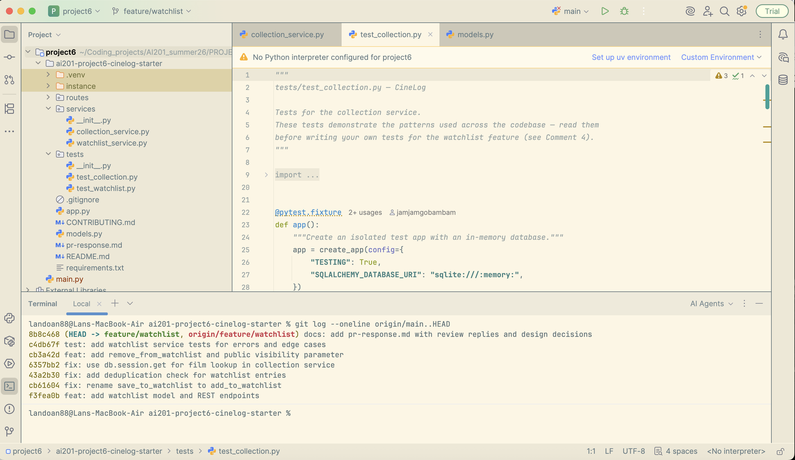

# PR Response Doc — CineLog Watchlist Feature

## AI Usage

I used Cursor (Composer) as a coding assistant during this project in these ways:

1. **Codebase orientation** — Asked for summaries of `models.py`, `services/collection_service.py`, and `tests/test_collection.py` before reading the PR comments, then verified each summary against the actual code (especially how `add_to_collection()` checks for duplicates and what it raises).
2. **Devil’s-advocate stress test (Comments 4 & 5)** — After drafting my own visibility and sort-order arguments, I asked what a careful reviewer might push back on. For Comment 4, that surfaced the “users may assume private-by-default” privacy risk more sharply, so I made the tradeoff section more concrete. For Comment 5, it challenged whether alphabetical sorting scales poorly for long lists; I kept alphabetical but explicitly addressed that by noting CineLog can add a `?sort=` query param later without changing the default.
3. **Conventional-commit check** — After rewriting history, I reviewed `git log --oneline` against CineLog’s `CONTRIBUTING.md` prefixes (`feat:`, `fix:`, `test:`, `docs:`) to confirm each commit is one logical change.

I did **not** ask AI to invent the design decisions or write the deduplication logic from scratch; those were grounded in CineLog’s existing `add_to_collection()` / `get_collection()` patterns and my own reasoning about the product.

---

## Comment 1 — Rename

**What I did:**
Renamed `save_to_watchlist()` → `add_to_watchlist()` in `services/watchlist_service.py` and updated the call site in `routes/watchlist/watchlist.py`. I project-searched for `save_to_watchlist` to confirm no other references remained.

**How I verified:**
- Repo-wide search showed zero remaining references to `save_to_watchlist`.
- Confirmed the new name matches `CONTRIBUTING.md`’s `verb_to_noun` convention alongside `add_to_collection()`.
- `pytest tests/ -v` passed after the rename.

---

## Comment 2 — Deduplication

**What I did:**
Mirrored `add_to_collection()`: before inserting, query for an existing `WatchlistEntry` with the same `user_id` + `film_id`. If found, raise `AlreadyOnWatchlistError` (parallel to `AlreadyInCollectionError`). Also added a DB-level `UniqueConstraint` on `(user_id, film_id)` on `WatchlistEntry`, matching `CollectionEntry`. The route maps that exception to HTTP 409.

**How I verified:**
- Compared the check line-by-line with `add_to_collection()` in `services/collection_service.py`.
- Added `test_add_to_watchlist_duplicate_raises` and ran `pytest tests/test_watchlist.py -v`.
- Confirmed a second add attempt leaves exactly one row in the table.

---

## Comment 3 — Missing test

**What I did:**
Created `tests/test_watchlist.py` and added `test_add_to_watchlist_nonexistent_film_raises`, modeled on `test_add_to_collection_nonexistent_film_raises` (same fixtures pattern, same fake UUID, same `pytest.raises(FilmNotFoundError)` assertion).

**How I verified:**
```
pytest tests/test_watchlist.py::test_add_to_watchlist_nonexistent_film_raises -v
pytest tests/ -v
```
Both passed.

---

## Comment 4 — Default visibility

**My position:**
Keep `public=True` as the default for new watchlist entries.

**Reasoning:**
CineLog is framed as a *community* film tracking app (README: “community film tracking”). The collection side of the product already treats logged films as shareable social artifacts—ratings and “what I watched” are inherently discovery content. A watchlist is the “what I’m planning to watch” counterpart: making it public by default lets friends discover films to recommend or watch together without an extra toggle on every add. That optimizes for the social loop the product is built around (discovery → discussion → logging), and keeps the common path (`POST …/add` with just `film_id`) low-friction.

Keeping the default public is also consistent with the model as shipped—we’re making the default intentional in the product sense, not silently inheriting a column default. Callers who need privacy can pass `"public": false` (stretch) or we can add a per-user preference later.

**Tradeoff acknowledged:**
Public-by-default is worse for privacy-sensitive users who expect lists to be private until they opt in. Someone saving films for a surprise movie night, avoiding spoilers, or simply wanting a private queue can accidentally expose intent. That risk is real. Mitigation: explicit `public` on the add endpoint, clear API docs, and (future) a user-level default that overrides the system default. I’m accepting that tradeoff because CineLog’s primary value today is community discovery, and silent-private defaults would suppress the social features the app is selling—but we should not pretend the privacy downside doesn’t exist.

---

## Comment 5 — Sort order

**My position:**
Keep alphabetical-by-title as the default sort for `get_watchlist()`. I am pushing back on switching the default to date-added.

**Reasoning:**
A watchlist and a collection solve different jobs. `get_collection()` is an activity log—“what did I watch recently?”—so newest-first is the right default there, and I agree with that. A watchlist is a *planning* list: users open it to answer “what should I watch?” Often they’ve accumulated dozens of titles over months. Scanning by title is how you find “the Nolan one” or “that A24 drama” in a queue; recency of *adding* a title rarely matches recency of *wanting* to watch it. Alphabetical gives a stable, predictable order that doesn’t reshuffle every time you add something new to the bottom of your intent list.

**Engagement with reviewer’s point:**
The reviewer is right that many product UIs bias toward “recently added” for feeds and that users often care about what they saved lately. That argument maps cleanly onto the collection (and onto a *feed*), but less cleanly onto a personal backlog. If we adopted date-added as the only order, users with long watchlists lose efficient lookup. If we need both behaviors, the better product move isn’t to change the default silently—it’s to keep alphabetical as the predictable default and add an optional `?sort=date_added` later for users who want a “recently saved” view. I’m documenting that decision here so we’re intentional: same product, different list semantics than collection.

---

## Comment 6 — Rebase

**What conflicted:**
1. `.gitignore` — add/add against `main`’s existing ignore file (resolved by keeping main’s `.pytest_cache/` entry plus our env/venv/db ignores; then skipped our duplicate chore commit).
2. `models.py` — content conflict when replaying the watchlist model changes onto post-refactor `main`. `Film.id` / `CollectionEntry.film_id` were already UUIDs (`String(36)`) on `main`, while the feature branch still introduced `WatchlistEntry.film_id` as `Integer`.

**How I resolved it:**
- Kept main’s UUID `Film` / `CollectionEntry` definitions.
- Re-added `WatchlistEntry` with `film_id = db.Column(db.String(36), …)` to match the refactor.
- Updated watchlist service/route docstrings from `int` to UUID strings.
- Preserved relationships and the unique constraint on `(user_id, film_id)`.

**How I verified no conflict remains:**
```
git rebase origin/main   # completed successfully
git log --oneline --merges origin/main..HEAD   # empty — no merge commits
pytest tests/ -v   # 11 passed
```
Also confirmed `WatchlistEntry.film_id` and `Film.id` are both `String(36)` in `models.py`.

---

## Stretch Features

### `remove_from_watchlist()`
Added `remove_from_watchlist(user_id, film_id)` mirroring `remove_from_collection()`, with `NotOnWatchlistError` and a `DELETE /watchlist/<user_id>/remove` route. Covered by `test_remove_from_watchlist_deletes_entry`.

### Extra edge-case test
`test_remove_from_watchlist_missing_raises` — removing a film that was never on the watchlist should raise, not succeed silently. Chosen because it mirrors `NotInCollectionError` and protects the DELETE endpoint from a false “Removed” success.

### Visibility toggle
`add_to_watchlist(..., public=True)` accepts an explicit `public` argument; the POST body may include `"public": false`. Covered by `test_add_to_watchlist_respects_public_flag`.

---

## Commit history (`git log --oneline`)

Final history after rewrite (verify live with `git log --oneline origin/main..HEAD`):



```
docs: add pr-response.md with review replies and design decisions
test: add watchlist service tests for errors and edge casesgi
feat: add remove_from_watchlist and public visibility parameter
fix: use db.session.get for film lookup in collection service
fix: add deduplication check for watchlist entries
fix: rename save_to_watchlist to add_to_watchlist
feat: add watchlist model and REST endpoints
```

---

## PR Description

### Summary
Adds a **watchlist** so users can save films they intend to watch later (separate from the collection of films already logged as watched). Includes `WatchlistEntry` model, service helpers (`add_to_watchlist`, `get_watchlist`, `remove_from_watchlist`), and REST endpoints under `/watchlist`.

### Design decisions
1. **Default visibility (`public=True`)** — Public by default to favor CineLog’s community/discovery loop; private opt-out via `"public": false` on add. See Comment 4 above.
2. **Sort order (alphabetical by title)** — Kept A–Z for watchlists (planning list), distinct from collection’s newest-first activity log. See Comment 5 above.

### How to manually test
1. Create/activate a venv, `pip install -r requirements.txt`, run `python app.py`.
2. Ensure a user and film exist in the DB (or insert via Flask shell / fixtures). Note film IDs are UUIDs.
3. Add a film:
   ```bash
   curl -X POST http://127.0.0.1:5000/watchlist/<user_id>/add \
     -H 'Content-Type: application/json' \
     -d '{"film_id":"<film_uuid>"}'
   ```
4. Add again with the same `film_id` — expect **409** conflict (dedup).
5. Add with privacy override:
   ```bash
   curl -X POST http://127.0.0.1:5000/watchlist/<user_id>/add \
     -H 'Content-Type: application/json' \
     -d '{"film_id":"<other_film_uuid>","public":false}'
   ```
6. List watchlist (titles should be alphabetical):
   ```bash
   curl http://127.0.0.1:5000/watchlist/<user_id>
   ```
7. Remove an entry:
   ```bash
   curl -X DELETE http://127.0.0.1:5000/watchlist/<user_id>/remove \
     -H 'Content-Type: application/json' \
     -d '{"film_id":"<film_uuid>"}'
   ```
8. Run automated suite: `pytest tests/ -v`.
